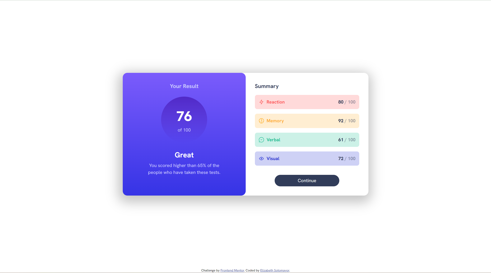

# Frontend Mentor - Results summary component solution

This is a solution to the [Results summary component challenge on Frontend Mentor](https://www.frontendmentor.io/challenges/results-summary-component-CE_K6s0maV). Frontend Mentor challenges help you improve your coding skills by building realistic projects. 

## Table of contents

- [Overview](#overview)
  - [The challenge](#the-challenge)
  - [Screenshot](#screenshot)
  - [Links](#links)
- [My process](#my-process)
  - [Built with](#built-with)
  - [What I learned](#what-i-learned)
  - [Continued development](#continued-development)
  - [Useful resources](#useful-resources)
- [Author](#author)

## Overview

### The challenge

Users should be able to:

- View the optimal layout for the interface depending on their device's screen size
- See hover and focus states for all interactive elements on the page

### Screenshot

### Links

- Solution URL: [Github](https://github.com/elizabethrsotomayor/results-summary-component-main)
- Live Site URL: [Results Summary Component](https://elizabethrsotomayor.github.io/results-summary-component-main/)

## My process

### Built with

- Semantic HTML5 markup
- CSS custom properties
- Flexbox

### What I learned

I completed this challenge as a way to get re-acquainted with HTML/CSS since I was without a computer for a while. I re-learned how to structure HTML markup and used CSS flexbox to complete this challenge. I built each side of the component separately, breaking each piece down to create a cohesive final product. I refreshed my memory about centering divs and centering the content inside of the div.

### Continued development

I want to work more with flexbox and make sure that my use of padding/margin is correct and works with different screen sizes.

### Useful resources

- [CSSmatic Box Shadow Generator](https://www.cssmatic.com/box-shadow) - I used this tool to create the box shadow effect on the card component. I found it very useful.
- [MDN Adding vector graphics to the web](https://developer.mozilla.org/en-US/docs/Learn/HTML/Multimedia_and_embedding/Adding_vector_graphics_to_the_Web) - I consulted this MDN page to make sure I was adding my SVG icons correctly.

## Author

- Website - [Somyo Design Co](https://elizabethrsotomayor.github.io/somyo2/)
- Frontend Mentor - [@elizabethrsotomayor](https://www.frontendmentor.io/profile/elizabethrsotomayor)
- Instagram - [@corinne_indiana](https://www.instagram.com/corinne_indiana)
